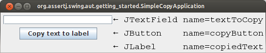

# Getting started guide

Assuming you have a bit time, here's a detailed introduction to AssertJ Swing. You may want to have a
look at <a href="assertj-swing-quick-start.html">the quick start guide</a> that allows you to create
and run an AssertJ Swing test case in the least possible time.

### Get AssertJ Swing

AssertJ Swing artifacts are in Maven central repository. There are two main artifacts:
<code>assertj-swing-testng</code> and <code>assertj-swing-junit</code>.

It should be obvious that JUnit4 users should depend on <code>assertj-swing-junit</code>
while JUnit5 users should depend on <code>assertj-swing-junit-jupiter</code> ;-)


### Write your first GUI test

As the `Assertions` class is the main entry point to use AssertJ Core, the package
<a href="swing/api/org/assertj/swing/fixture/package-summary.html" target="_blank">org.assertj.swing.fixture</a>
is the main entry point to use AssertJ Swing. These fixtures provide specific methods to simulate
user interaction with a GUI component and also provide assertion methods that verify the state of such
a GUI component. Although you could work with the
<a href="swing/api/org/assertj/swing/core/Robot.html" target="_blank">Robot</a> directly, the Robot is too
low-level and requires considerably more code than the fixtures.

There is one fixture per Swing component. Each fixture has the same name as the Swing component they can
handle ending with <em>Fixture</em>. For example, a <code>JButtonFixture</code> knows how to simulate user
interaction and verify the state of a <code>JButton</code>.

You're now going to write your first test, let's assume we have a simple <code>JFrame</code> that contains
a <code>JTextField</code>, a <code>JLabel</code> and a <code>JButton</code>:



The expected behavior of this GUI is, when the user clicks on the button, the text of the text field
should be copied to the label. Now, which steps are necessary to test this GUI?

The source code of this sample application can be found <a href="https://github.com/joel-costigliola/assertj-examples/blob/master/assertj-swing-aut/src/main/java/org/assertj/swing/aut/getting_started/SimpleCopyApplication.java" target="_blank">here</a>. The test we are going to develop can be found
<a href="https://github.com/joel-costigliola/assertj-examples/blob/master/assertj-swing-junit-examples/src/test/java/org/assertj/swing/junit/examples/getting_started/SimpleCopyApplicationTest.java" target="_blank">here</a>.

#### 1. Enable checks for EDT access violation

AssertJ Swing provides the class <code>FailOnThreadViolationRepaintManager</code> that forces a test to fail if
access to GUI components is not performed on the EDT. You can find more details
[Testing violations](assertj-swing-edt.html#testing-violations)

#### 2. Create a fixture for the frame

Depending on the GUI to test, create a fixture to handle either a <code>Frame</code> or a <code>Dialog</code>
in the <code>setUp()</code> method of your test. The <code>setUp()</code> method is the method that
initializes the test fixtures, it should run every time <strong>before</strong> a test method is
executed:

- When using <em>JUnit 3.8.x</em>, this is the method named <code>setUp()</code>
- When using <em>JUnit 4.x</em>, this is the method marked with <code>@Before</code>
- When using <em>TestNG</em>, this is the method marked with <code>@BeforeMethod</code>


         Since our example uses a <code>JFrame</code>, we have to use a <code>FrameFixture</code>.

```java
private FrameFixture window;

@Before
public void setUp() {
  SimpleCopyApplication frame = GuiActionRunner.execute(() -&gt; new SimpleCopyApplication());
  window = new FrameFixture(frame);
  window.show(); // shows the frame to test
}
```

It may seem a little weird the way we create a new instance of <code>SimpleCopyApplication</code>. Since
creation of a frame triggers a <em>paint</em> action, we need to create the frame in the Event Dispatch
Thread (EDT). More details about the EDT and Swing threading can be found <a href="assertj-swing-edt.html">here</a>.

#### 3. Write methods to test your GUI's behavior</h4>

Now you can start by using the fixtures to test the GUI. AssertJ Swing fixtures simulate a user interacting
with the GUI in order to verify that such GUI behave as we expect. For our example, we need to verify that
the text in the text field is copied to the label when the button is clicked:

```java
 class="language-java">@Test
public void shouldCopyTextInLabelWhenClickingButton() {
  window.textBox("textToCopy").enterText("Some random text");
  window.button("copyButton").click();
  window.label("copiedText").requireText("Some random text");
}
```

As you probably noticed already, in our example we look up UI components by their unique name. This is
probably the most stable way, more about finding the components can be found <a href="assertj-swing-lookup.html">here</a>.

#### 4. Cleaning up resources used by AssertJ Swing
AssertJ Swing forces sequential test execution, regardless of the testing framework. To do so, it uses a
semaphore to give access to the keyboard and mouse to a single test. Cleaning up resources after running
each test method releases the lock on such semaphore. To clean up resources simply call the method
<code>cleanUp()</code> on the AssertJ Swing fixture inside:

- <code>tearDown()</code>, when using <em>JUnit 3.8.x</em>
- the method marked with <code>@After</code>, when using <em>JUnit 4.x</em>
- the method marked with <code>@AfterMethod</code>, when using <em>TestNG</em>


```java
 class="language-java">@After
public void tearDown() {
  window.cleanUp();
}
```

#### Putting everything together

```java
public class SimpleCopyApplicationTest {
  private FrameFixture window;

  @BeforeClass
  public static void setUpOnce() {
    FailOnThreadViolationRepaintManager.install();
  }

  @Before
  public void setUp() {
    SimpleCopyApplication frame = GuiActionRunner.execute(() -&gt; new SimpleCopyApplication());
    window = new FrameFixture(frame);
    window.show(); // shows the frame to test
  }

  @Test
  public void shouldCopyTextInLabelWhenClickingButton() {
    window.textBox("textToCopy").enterText("Some random text");
    window.button("copyButton").click();
    window.label("copiedText").requireText("Some random text");
  }

  @After
  public void tearDown() {
    window.cleanUp();
  }
}
```


### Alternatively, extend a AssertJ Swing test case

AssertJ Swing provides a base test class, to simplify creation of GUI tests. The following code listing
provides the same functionality as the code above, with less code, thanks to
<code>AssertJSwingJUnitTestCase</code>. The source can be found <a href="https://github.com/joel-costigliola/assertj-examples/blob/master/assertj-swing-junit-examples/src/test/java/org/assertj/swing/junit/examples/getting_started/SimpleCopyApplication_UseBaseTest.java" target="_blank">here</a>.

```java

public class SimpleCopyApplication_UseBaseTest extends AssertJSwingJUnitTestCase {
  private FrameFixture window;

  @Override
  protected void onSetUp() {
    SimpleCopyApplication frame = GuiActionRunner.execute(() -&gt; new SimpleCopyApplication());
    // IMPORTANT: note the call to 'robot()'
    // we must use the Robot from AssertJSwingJUnitTestCase
    window = new FrameFixture(robot(), frame);
    window.show(); // shows the frame to test
  }

  @Test
  public void shouldCopyTextInLabelWhenClickingButton() {
    window.textBox("textToCopy").enterText("Some random text");
    window.button("copyButton").click();
    window.label("copiedText").requireText("Some random text");
  }
}
```

> **_Do not create a new Robot!_**
> When using a base test case, do not create a new `Robot`. The base test
>  case creates one for you! If there is more than one `Robot` in your test, <strong>only the
>  first one will have access to the screen</strong>, while the rest will block till they get the
>  **screen lock**. A `Robot` can be created manually or indirectly using the constructors
>  `FrameFixture(Frame)` or `DialogFixture(Dialog)`. Please use the overloaded
>  versions that take a `Robot` as parameter, passing the already created `Robot`
>  (`robot()`).
