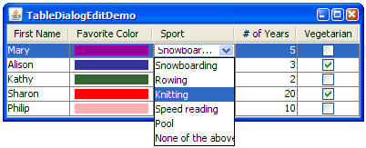

# Input Simulation

AssertJ Swing uses an <a href="http://java.sun.com/javase/6/docs/api/java/awt/Robot.html" target="_blank">AWT Robot</a> to generate user input. The AWT Robot is
capable of generating native events, providing the most accurate simulation of an actual user. The
`Robot` can move the mouse pointer and press keys just like a user would.

## Simulating keyboard input

All AssertJ Swing fixtures can simulate user input using a keyboard. This simulation is not limited
to send events to `KeyListeners`. AssertJ Swing provides true keyboard input, at the
operating system level.

### Pressing and releasing one or more keys

The method `pressAndReleaseKeys(int...)` can simulate a user pressing and releasing one or more
keys. If more than one key code is passed as parameter, this method will simulate pressing a key, releasing
it and then will process the next key code. Key codes are integers specified in
`java.awt.event.KeyEvent`.

The following example shows how to simulate a user pressing the keys `A`, `S`,
`D`, `F` while having focus on a text field with name `username` which is
similar to typing `asdf` on that text field.

```java
// import static java.awt.event.KeyEvent.*;
dialog.textBox("username").pressAndReleaseKeys(VK_A, VK_S, VK_D, VK_F);
```

Simulating a user pressing the key <kbd>F1</kbd> while having focus on a button with name `configure` would be

```java
// import static java.awt.event.KeyEvent.*;
dialog.button("configure").pressAndReleaseKeys(VK_F1);
```

### Pressing a key, doing something else, and releasing the key

The methods `pressKey(int)` and `releaseKey(int)` can simulate a user pressing and
releasing a key. Although it may sound similar to what the method `pressAndReleaseKeys(int...)`
does, it is a bit different. The `pressAndReleaseKeys(int...)` simulates a user pressing a key
and immediately releasing the same key. On the other hand, `pressKey(int)` and
`releaseKey(int)` are two separate actions. They can be helpful when you want to simulate a case
of <em>press a key, do something else, and then release the key</em>.

An example will illustrate this and give a better idea what these methods are good for. In the following
code we're simulating clicking the left mouse button while having the <kbd>Ctrl</kbd> key pressed:

```java
// import static java.awt.event.KeyEvent.*;
dialog.list("employees").pressKey(VK_CONTROL)
                        .click()
                        .releaseKey(VK_CONTROL);
```

You can even simplify this by using `pressKeyWhileRunning(int, Runnable)` which takes a
 `Runnable` to run between pressing and releasing keys:

```java
// import static java.awt.event.KeyEvent.*;
dialog.list("employees").pressKeyWhileRunning(VK_CONTROL, dialog.list("employees")::click);
```


### Typing text

Often we just want to enter some text into a text field. Using `pressAndReleaseKeys(int...)`
is unhandy for this purpose. The text component fixtures have a method `enterText(String)` to
simplify entering text. The example from above, typing `asdf` into a text field then looks
like

```java
dialog.textBox("username").enterText("asdf");
```

## Simulating mouse clicks

All AssertJ Swing fixtures can simulate user input using a mouse. This simulation is not limited to
send events to implementations of `MouseListener`. AssertJ Swing provides true mouse
input, at the operating system level, too. For example, simulating a user moving the mouse will result in
the mouse pointer moving to a specified location.

### Simple click

The method `click()` can simulate a user clicking a component once, using the left mouse
button. Let's see how to simulate a user clicking the button with name `connect`:

```java
frame.button("connect").click();
```

The following are alternative (and more verbose) ways to click a component once, using the left mouse
button:

```java
// import static org.assertj.swing.core.MouseButton.LEFT_BUTTON;
frame.button("connect").click(LEFT_BUTTON);

// import static org.assertj.swing.core.MouseClickInfo.leftButton;
frame.button("connect").click(leftButton().times(1));
```


### Double click and right click

In addition to `click()` there are the methods `doubleClick()` (for
double-clicking a component, using the left mouse button) and `rightClick()` (for clicking a
component once, using the right mouse button).

<h3>Click using specific button, many times</h3>
Since there aren't only left and right mouse buttons, and you may want to click more than twice,
AssertJ Swing has the method `click(MouseClickInfo)` to allow such a functionality.
With `MouseClickInfo` you can specify the mouse button and the number of clicks.

What does that look like? We already used this method above. But let's see how you would make
AssertJ Swing clicking three times the radio button with name `monthly` using the left
mouse button:

```java
// import static org.fest.swing.core.MouseClickInfo.leftButton;
frame.radioButton("monthly").click(leftButton().times(3));
```


## Simulating Drag 'n Drop

AssertJ Swing supports simulation of drag 'n drop via the class
<a href="swing/api/org/assertj/swing/core/ComponentDragAndDrop.html" target="_blank">ComponentDragAndDrop</a>.
This class supports drag 'n drop operations on screen coordinates and swing components. In addition, the
following fixtures provide component-specific implementations of drag 'n drop, to simulate a user dragging
'n dropping on `JList`, `JTable` and `JTree`, respectively:

1. `JListFixture`
1. `JTableFixture`
1. `JTreeFixture`


> **_Note_**
>  AssertJ Swing's drag 'n drop will effectively simulate a user pressing the left mouse button,
>  moving the mouse to a particular location and releasing the mouse. However, it is up to you to
>  implement drag 'n drop in your Swing components. To learn more about drag 'n drop, please visit
>  <a href="http://java.sun.com/docs/books/tutorial/uiswing/dnd/intro.html" target="_blank">Sun's Swing Tutorial</a>.

### Examples
#### JList

The following example shows dragging the element <em>Swing</em> from the list `source` and
dropping it in the list `destination` on the element <em>AWT</em>. Which might insert
<em>Swing</em> before or after <em>AWT</em>, depending on the implementation of the
`TransferHandler` used.

```java
dialog.list("source").drag("Swing");
dialog.list("destination").drop("AWT");
```

#### JTable

The following example shows dragging the content of the cell at row&nbsp;3, column&nbsp;0 from the table
`source` and dropping it on the table `destination` at row&nbsp;1, column&nbsp;0.

```java
// import static org.assertj.swing.fixture.TableCell.TableCellBuilder.row;
dialog.table("source").drag(row(3).column(0));
dialog.table("destination").drop(row(1).column(0));
```

#### JTree

The following example shows dragging the node <em>branch1.1</em> (in the path <em>root/branch1</em>) from
the tree `source` and dropping it in the tree `destination` on the node <em>root</em>.

```java
dialog.tree("source").drag(path("root", "branch1", "branch1.1"));
dialog.tree("destination").drop(path("root"));
```


## Simulating editing table cells

AssertJ Swing provides support for editing `JTable` cells as if a user was doing it. Out
of the box `JCheckBox`, `JComboBox` and `JTextField` are supported as
custom cell editors:



There are many ways to simulate a user editing a `JTable` cell:

### `JTableFixture`

A `JTableFixture` provides the method `enterValue(TableCell, String)` which simulates
a user entering the given value in the given cell, regardless of the underlying cell editor. Even though
the value to enter is always a String, `JTableFixture` can figure out how to use the underlying
cell editor.

The following code illustrates how to select the value <em>Pool</em> from the `JComboBox` in
row&nbsp;0, column&nbsp;2 (see picture above).

```java
JTableFixture table = dialog.table("data");
// import static org.assertj.swing.data.TableCell.row;
table.enterValue(row(0).column(2), "Pool");
```

Here we are selecting the `JCheckBox` in row&nbsp;1, column&nbsp;4:

```java
JTableFixture table = dialog.table("data");
// import static org.assertj.swing.data.TableCell.row;
table.enterValue(row(1).column(4), "true");
```

### `JTableCellFixture`

A `JTableCellFixture` provides the method `enterValue(String)`, which can also
simulate a user editing a table cell, just like `JTableFixture`. The following code illustrates
how to select the value <em>Pool</em> from the `JComboBox` in row&nbsp;0, column&nbsp;2:

```java
JTableFixture table = dialog.table("data");
// import static org.assertj.swing.data.TableCell.row;
JTableCellFixture cell = table.cell(row(0).column(2));
cell.enterValue("Pool");
```

 Here we are selecting the `JCheckBox` in row&nbsp;1, column&nbsp;4:

 ```java
JTableFixture table = dialog.table("data");
// import static org.assertj.swing.data.TableCell.row;
JTableCellFixture cell = table.cell(row(1).column(4));
cell.enterValue("true");
```

### Having more control of the cell editor

To have more control of the underlying cell editor, it is possible to wrap it with an implementation of
`ComponentFixture`. The `JTableCellFixture` provides the method `editor()`,
which returns the `Component` used as editor of a cell. `JTableCellFixture` also
provides the methods `startEditing`, `stopEditing` and `cancelEditing`.
The following example illustrates how to use them:

```java
// import static org.assertj.swing.data.TableCell.row;
TableCellFixture cell = table.cell(row(6).column(8));
Component editor = cell.editor();
// assume editor is a JTextField
JTextComponentFixture textBoxEditor = new JTextComponentFixture(robot, (JTextField)editor);
cell.startEditing();
textBoxEditor.enterText("Hello");
cell.stopEditing();
```

### Custom cell editors

AssertJ Swing also supports custom cell editors. For more information, please read
<a href="assertj-swing-advanced.html#custom-editors">Custom Cell Editors</a>.

