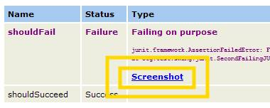

# Screenshots of test failures

On some occasions, a functional GUI test will run perfectly from within the IDE but will break when executed
in a batch with other tests (such as when you are using Ant). This is because functional GUI tests are
vulnerable to certain environment-related events, and AssertJ Swing is no exception.

It occasionally may happen that antivirus software runs a scheduled scan while a GUI is under test. If the
antivirus software pops up a dialog in front of the GUI, the AssertJ Swing robot will not be able to
access the GUI and will time out eventually, making the test fail. In this case, the failure is not related
to a programming error; it is just a case of bad timing.

AssertJ Swing is capable of taking a screenshot of the desktop when a GUI test fails, regardless of
the test framework you use (TestNG or JUnit). You then can use this screenshot to analyse the cause of a
failed test and discover whether it is programmatic or environmental.

There are many ways to take a screenshot of the desktop when a GUI test fails. Regardless of how
AssertJ Swing takes a screenshot, it needs to know which tests should be considered <em>GUI
tests</em>. In order to do so, we only need to add the annotation `@GUITest`. This annotation
can be placed at class or method level, and it is inherited by subclasses of annotated classes.

Once our GUI tests have the `@GUITest` annotation, we can take a screenshot of the desktop when
a GUI test fails. See the following sections for the how-to.

## How to take screenshots manually

Taking a screenshot of the desktop is quite simple. The class `ScreenshotTaker` provides two
methods:

- `takeDesktopScreenshot()` takes a screenshot of the desktop and returns it as a
   `BufferedImage`.
- `saveDesktopAsPng(String)` takes a screenshot of the desktop and saves it as a PNG image
    using the file path passed as argument.

### Example

This example takes a screenshot of the desktop when a test fails and saves the image as
`myTest.png`:

```java
// import static org.assertj.core.util.Files.currentFolder;
// import static java.io.File.separator

ScreenshotTaker screenshotTaker = new ScreenshotTaker();

String currentFolderPath = currentFolder().getCanonicalPath();

File imageFolder = new File(currentFolderPath + separator + "failed-tests");
String imageFolderPath = imageFolder.getCanonicalPath() + separator;

try {
  // perform your test
} catch (Exception e) {
  // test failed
  screenshotTaker.saveDesktopAsPng(imageFolderPath + "myTest.png");
  throw e;
}
```


## How to take screenshots of test failures with JUnit
AssertJ Swing can take a screenshot of the desktop when a JUnit GUI test fails, either when running
tests using Ant or inside an IDE (e.g., Eclipse). To take screenshots of failed GUI tests you have to
add the `@GUITest` annotation and make sure that you've included the
`assertj-swing-junit` artifact.

### Running with the JUnit Runner

For running GUI tests in an IDE, AssertJ Swing provides a custom JUnit runner,
`GUITestRunner`, which takes screenshots of failed GUI tests. To use it, just annotate your test
class with `@RunWith(GUITestRunner.class)`. Screenshots of failed tests will be saved in the
directory `failed-gui-tests` (relative to the directory where tests are executed).

### Running with Ant

In order to take screenshots of failed GUI tests with Ant please follow these steps

- Add a definition of the Ant task `assertjreport`
- Use the formatter `ScreenshotOnFailureResultFormatter` inside the junit Ant task
- Use the Ant task `assertjreport` instead of `junitreport`, and specify in its
classpath where the `assertj-swing-junit` jar file is.

#### Example

```xml
&lt;target name="test" depends="compile"&gt;
&lt;taskdef resource="assertjjunittasks" classpathref="lib.classpath" /&gt;

  &lt;junit forkmode="perBatch" printsummary="yes" haltonfailure="no" haltonerror="no"&gt;
    &lt;classpath refid="lib.classpath" /&gt;
    &lt;classpath location="${target.test.classes.dir}" /&gt;
    &lt;classpath location="${target.classes.dir}" /&gt;
    &lt;formatter classname="org.fest.swing.junit.ant.ScreenshotOnFailureResultFormatter" extension=".xml" /&gt;
    &lt;batchtest fork="yes" todir="${target.junit.results.dir}"&gt;
      &lt;fileset dir="${target.test.classes.dir}" includes="**/*Test*.class" /&gt;
    &lt;/batchtest&gt;
  &lt;/junit&gt;

  &lt;festreport todir="${target.junit.report.dir}"&gt;
    &lt;classpath refid="lib.classpath" /&gt;
    &lt;fileset dir="${target.junit.results.dir}"&gt;
      &lt;include name="TEST-*.xml" /&gt;
    &lt;/fileset&gt;
    &lt;report format="frames" todir="${target.junit.report.dir}/html" /&gt;
  &lt;/festreport&gt;
&lt;/target&gt;
```

`assertjreport` works exactly as `junitreport` but additionally produces a link as seen
in this screenshot:


